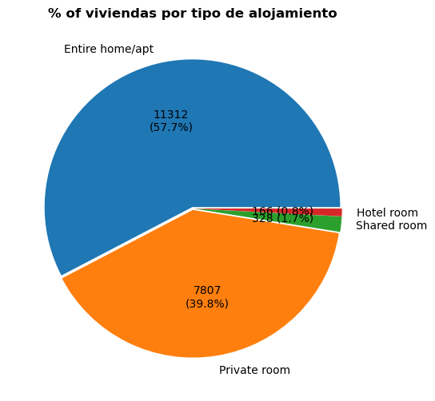

# Airbnb-Madrid

1. **Objetivo de este cuaderno**

    El presente proyecto se desarrollo pensando en la problemática del arriendo en Madrid, se queria comprobar que tanto afecta aplicaciones como Airbnb en el precio de los alquileres de Madrid.

    Actualmente varias de las agencias inmobilarias adquieren grandes propiedades y los conviernten en alojamientos turísticos provocando así que los precios suban al haber una cantidad menor de oferta.

    El objetivo del proyecto es:

        (-) Comprobar en que barrios de Madrid hay una mayor demanda de alquileres en la aplicación

        (-)Comprobar en que fechas del año hay una mayor demanda de viviendas

        (-)Comprobar cuál es  el tipo de alquiler más común: Existen cuatro posibles tipos de alquieres:
        Entire home/apt   
        Private room        
        Shared room   
        Hotel room

2. Proceso de extracción y de enrequecimiento de los datos 
   1. Para obtener los datos, se descargo varios csvs de Kaggle y el INE , los cuales se procedieron a limpiarlos con Pandas
   2. Como segunda fuente de extracción se realizó una extracción de datos mediante la API de avionstack(https://aviationstack.com/usage), debibo a las limitaciones de la versión de prueba únicamente se extrajeron 100 registros

   3. Finalme se complemento los datos mediante descargas del INE https://www.ine.es/

3.Dashboards

Se puede comprobar que la mayoría de las viviendas que se alquilan en Madrid corresponde a **departamantos o casas enteras**, esto se contradice con el objetivo de Airbnb ya que una de las principales causas que se creó la compañia fue para alquilar el espacio que les quedaba a los dueños de sus viviendas. 

De otra forma con el siguiente gráfico se observa que en los barrios del centro es dónde hay una mayor cantidad de viviendas disponibles

Enviargi 

    

